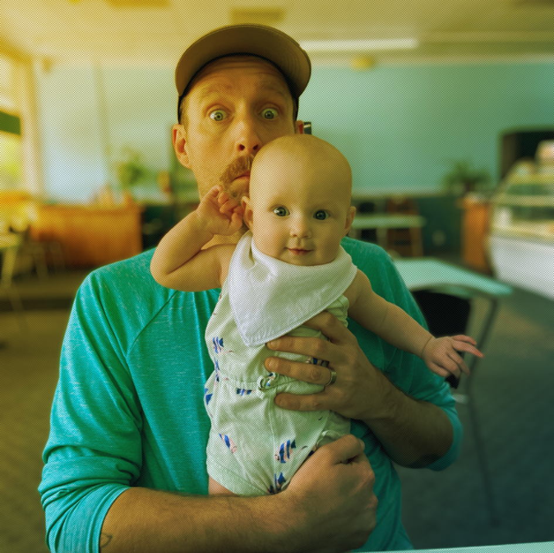

import Picture from "astro:assets"
import Image from "astro/components/Image.astro";
import image01 from "../../assets/projects/placeholder.png";

{/*  */}

{/* <Image src={image01} alt="" inferSize /> */}

<Image src={frontmatter.image.url} alt={frontmatter.image.alt} inferSize loading="lazy" class="mb-8 w-full transition-main" />

Nullam id dolor id nibh ultricies vehicula ut id elit. Fusce dapibus, tellus ac cursus commodo, tortor mauris condimentum nibh, ut fermentum massa justo sit amet risus.

